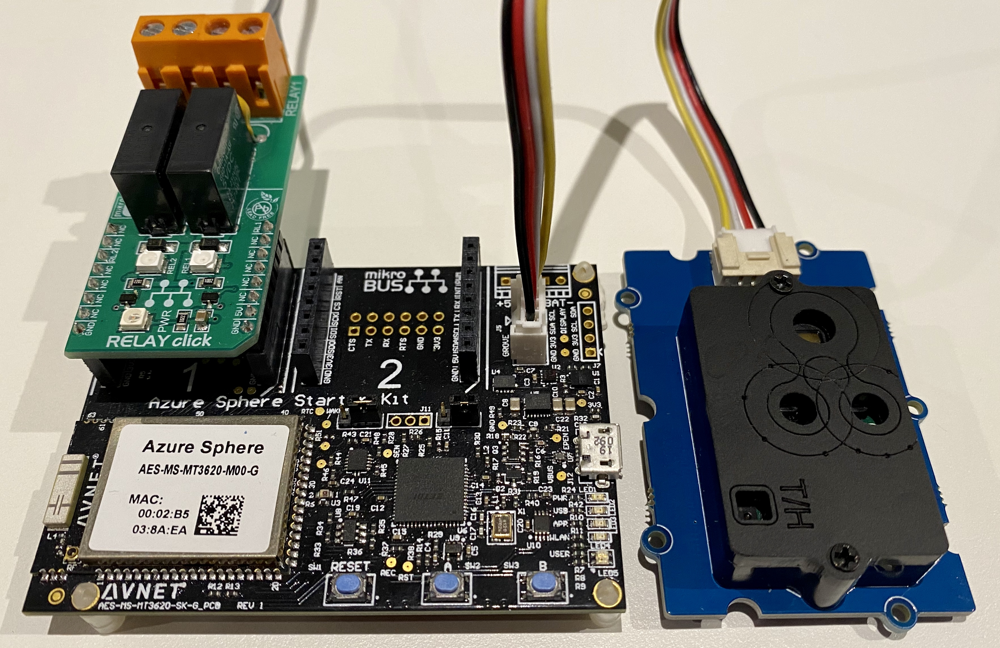
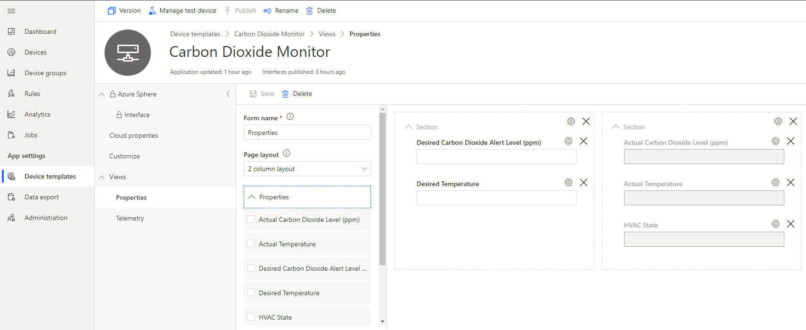
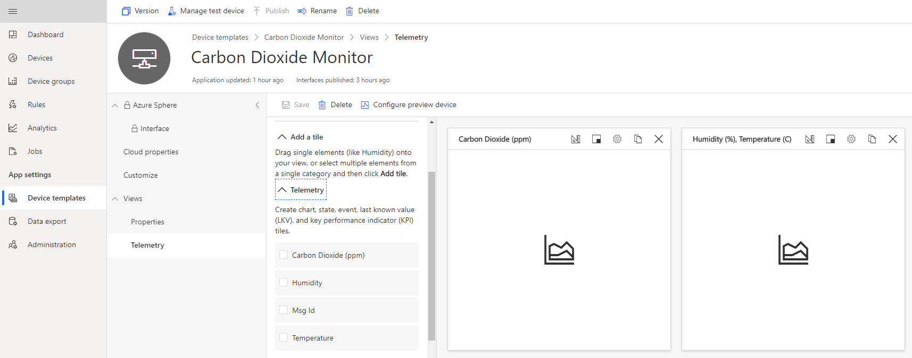

# Are CO2 levels making you grumpy, sleepy, or sad

**Follow** me on **Twitter** [@dglover](https://twitter.com/dglover)

How to build a workspace health CO2, temperature, and humidity monitor with [Azure Sphere](https://azure.microsoft.com/en-gb/services/azure-sphere/), a SDC30 sensor and [Azure IoT Central](https://azure.microsoft.com/en-gb/services/iot-central/).

Working from home it is easy to close the door to shut out the noise of everyday life while we get on with work. Carbon dioxide is a byproduct of our breathing and closing the door can mean Carbon Dioxide (CO2) is building up in our work spaces which can really impacting on our wellbeing, concentration, and productivity levels.

| | |
|---|---|
||  |

For the science, then check out [The importance of Indoor Air Quality (IAQ) for Business Performance and Wellbeing](https://iotfactory.eu/the-importance-of-indoor-air-quality-iaq-for-business-performance-and-wellbeing/).

The problem is we can't see or smell Carbon Dioxide, it just keeps building up and we have no way of knowing it is happening other than getting tired or a headache. So with that in mind, I figured it was Internet of Things to the rescue!

## The solution

I wanted to build a secure IoT device with [Azure Sphere](https://azure.microsoft.com/en-gb/services/azure-sphere/) using the [Seeed Studio Grove CO2 & Temperature & Humidity Sensor](https://www.seeedstudio.com/Grove-CO2-Temperature-Humidity-Sensor-SCD30-p-2911.html) sensor I had in my box of bits. The folk at Sensirion made it super easy to port the [SCD30 driver](https://github.com/Sensirion/embedded-scd) Azure Sphere. It was really just a matter of implementing the I2C read and write functions and providing an implementation for microsecond sleep. It just worked!

I created a free trial of [Azure IoT Central](https://azure.microsoft.com/en-gb/services/iot-central/) and in no time I had CO2, temperature, and humidity telemetry displayed (yup, the data is real!). By the way, you can continue to connect two devices for free to IoT Central after the trail period expires.

## Parts list

The solution supports two configurations:

### Seeed Studio Azure Sphere Mini Dev Board

1. [Seeed Studio Seeed Studio MT3620 Mini Dev Board](https://www.seeedstudio.com/mt3620-for-azure-sphere)
2. [MT3620 Grove Breakout](https://www.seeedstudio.com/MT3620-Grove-Breakout-p-4043.html)
3. [Seeed Studio Grove CO2 & Temperature & Humidity Sensor](https://www.seeedstudio.com/Grove-CO2-Temperature-Humidity-Sensor-SCD30-p-2911.html)
4. Optional, [3 x Grove LEDs](), or a [Grove Relay](https://www.seeedstudio.com/Grove-Relay.html) to drive a bigger warning light!

### AVNET Azure Sphere Starter Kit

1. [AVNET Azure Sphere Starter Kit](https://www.avnet.com/shop/us/products/avnet-engineering-services/aes-ms-mt3620-sk-g-3074457345636825680/)
2. [Seeed Studio Grove CO2 & Temperature & Humidity Sensor](https://www.seeedstudio.com/Grove-CO2-Temperature-Humidity-Sensor-SCD30-p-2911.html)
3. Optional, 1 x [Click Relay](https://www.mikroe.com/relay-click) to drive a bigger warning light.

---

## How to build the solution

1. Clone this [CO2-levels-making-you-happy-grumpy-sleepy-or-sad](https://github.com/gloveboxes/CO2-levels-making-you-happy-grumpy-sleepy-or-sad) solution to your computer - Windows 10 or Linux Ubuntu 18.04 or 20.04.
2. Included in the repo is an IoT Central Device Template capabilities model to make it easy to build the IoT Central application.
3. Check out the [Azure Sphere Developer Learning Path](https://github.com/gloveboxes/Azure-Sphere-Learning-Path). You need to review the following two sections:
    1. [The development environment set up](https://github.com/gloveboxes/Azure-Sphere-Learning-Path/tree/master/zdocs_vs_code_iot_central/Lab_0_Introduction_and_Lab_Set_Up)
    2. [Setting up Azure IoT Central](https://github.com/gloveboxes/Azure-Sphere-Learning-Path/tree/master/zdocs_vs_code_iot_central/Lab_2_Send_Telemetry_to_Azure_IoT_Central) sections.

---

## IoT Central Application

When I created the Azure IoT Central device template I created the following views.

### Properties view

### Telemetry view

Have fun and stay safe and be sure to follow us on [#JulyOT](https://twitter.com/hashtag/JulyOT?src=hash&ref_src=twsrc%5Etfw).
